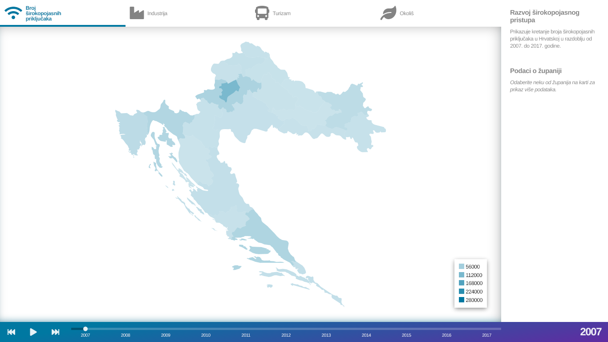
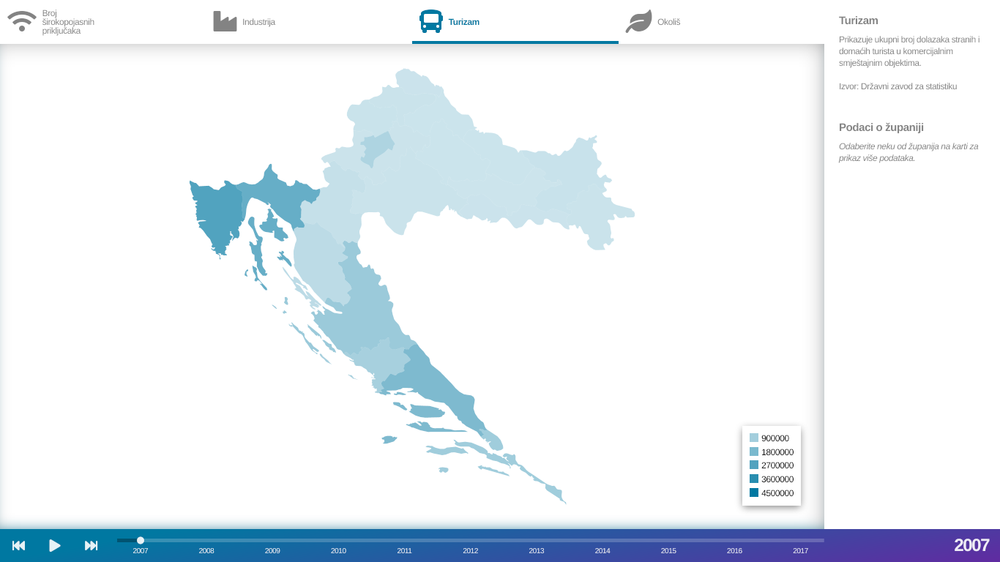
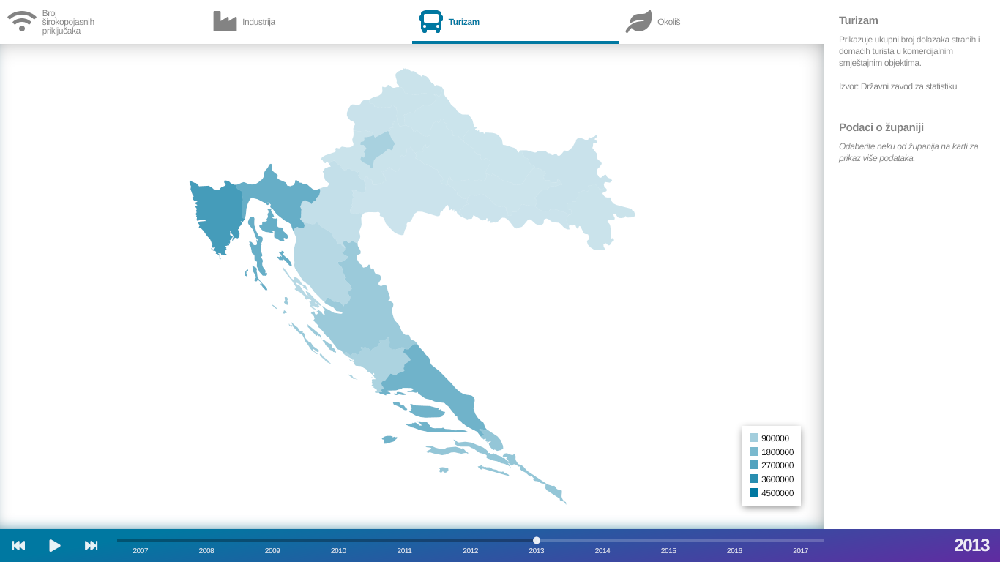
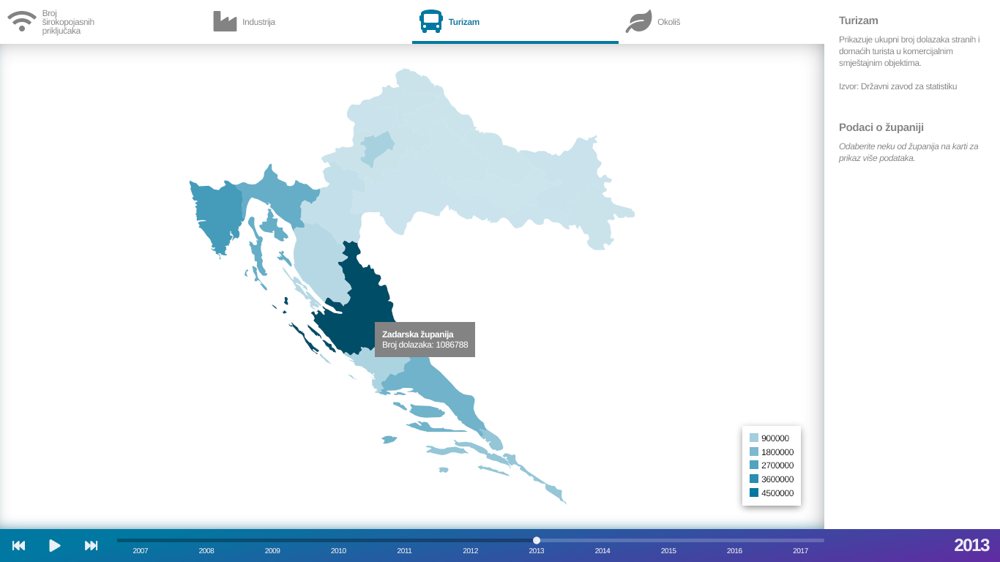
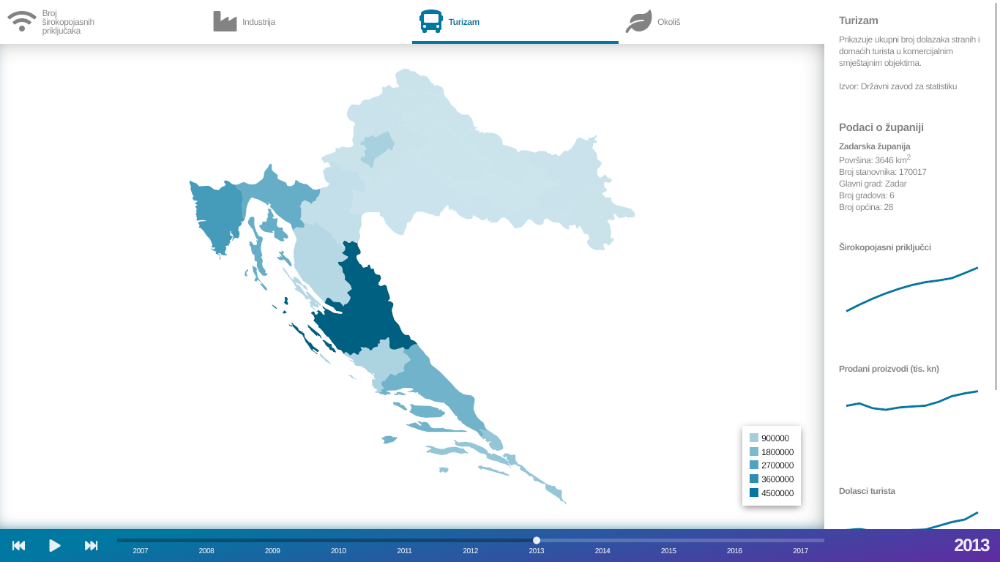
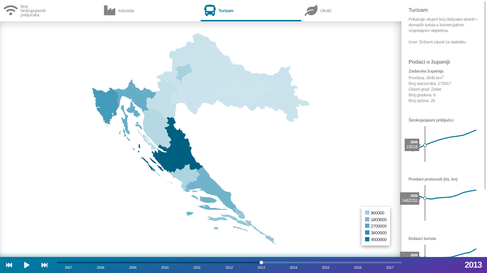

# Interactive map of Croatia

An interactive choropleth map application which shows evolution of a few
indicators related to economy in Croatia for years 2007 to 2017 at yearly
resolution. The indicators shown are access to broadband Internet, value of
exported products, number of tourist arrivals and environmental protection
expenditures.

Created using D3.js, TopoJSON and Queue.js libraries, both developed by D3.js
authors as well.

## Screenshots

&nbsp;
&nbsp;
&nbsp;
&nbsp;
&nbsp;


## Getting started

### Installation

To make this application run in your browser, you can:

* visit the [instance already set up on GitHub
Pages](https://skomaromi.github.io/dataviz/); or
* clone this repository and run it on your computer.

#### Cloning

This application loads files asynchronously from within JavaScript, so to run
it on your computer an all-in-one server solution like XAMPP, a web server
like NGINX or Apache, a [browser
extension](https://chrome.google.com/webstore/detail/web-server-for-chrome/ofhbbkphhbklhfoeikjpcbhemlocgigb)
or a [browser workaround](https://stackoverflow.com/a/39007324) is necessary.

Once that prerequisite is addressed, clone this repository to a directory of
your choice.
```bash
git clone https://github.com/skomaromi/dataviz.git
```

### Usage

Indicator currently shown by the map can be changed by clicking one of tabs in
the top part of screen.

Year currently shown can be changed by dragging the progress bar handle in the
bottom part of screen. Additionally, an animation can be started by pressing
the play button next to the progress bar. The animation will walk through
years 2007 to 2017 year by year, with map updating colors to reflect values of
selected indicator for current year. Clicking fast backward and forward
buttons will set year currently shown to 2007 and 2017, respectively.

Hovering one of counties will show exact indicator value for given year and by
clicking a county all indicators for that county are shown as graphs in the
sidebar.
